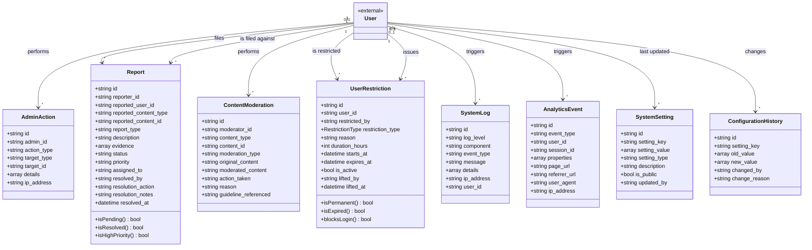

# Class Diagram: Administration (As-Built)

`User` appears as an external stub.

```mermaid
classDiagram
    class AdminAction {
        +string id
        +string admin_id
        +string action_type
        +string target_type
        +string target_id
        +array details
        +string ip_address
    }
    class Report {
        +string id
        +string reporter_id
        +string reported_user_id
        +string reported_content_type
        +string reported_content_id
        +string report_type
        +string description
        +array evidence
        +string status
        +string priority
        +string assigned_to
        +string resolved_by
        +string resolution_action
        +string resolution_notes
        +datetime resolved_at
        +isPending() bool
        +isResolved() bool
        +isHighPriority() bool
    }
    class ContentModeration {
        +string id
        +string moderator_id
        +string content_type
        +string content_id
        +string moderation_type
        +string original_content
        +string moderated_content
        +string action_taken
        +string reason
        +string guideline_referenced
    }
    class UserRestriction {
        +string id
        +string user_id
        +string restricted_by
        +RestrictionType restriction_type
        +string reason
        +int duration_hours
        +datetime starts_at
        +datetime expires_at
        +bool is_active
        +string lifted_by
        +datetime lifted_at
        +isPermanent() bool
        +isExpired() bool
        +blocksLogin() bool
    }
    class SystemLog {
        +string id
        +string log_level
        +string component
        +string event_type
        +string message
        +array details
        +string ip_address
        +string user_id
    }
    class AnalyticsEvent {
        +string id
        +string event_type
        +string user_id
        +string session_id
        +array properties
        +string page_url
        +string referrer_url
        +string user_agent
        +string ip_address
    }
    class SystemSetting {
        +string id
        +string setting_key
        +array setting_value
        +string setting_type
        +string description
        +bool is_public
        +string updated_by
    }
    class ConfigurationHistory {
        +string id
        +string setting_key
        +array old_value
        +array new_value
        +string changed_by
        +string change_reason
    }
    class User {
        <<external>>
    }

    User "1" --> "*" AdminAction : performs
    User "1" --> "*" Report : files
    User "0..1" --> "*" Report : is filed against
    User "1" --> "*" ContentModeration : performs
    User "1" --> "*" UserRestriction : is restricted
    User "1" --> "*" UserRestriction : issues
    User "0..1" --> "*" SystemLog : triggers
    User "0..1" --> "*" AnalyticsEvent : triggers
    User "0..1" --> "*" SystemSetting : last updated
    User "1" --> "*" ConfigurationHistory : changes
```
