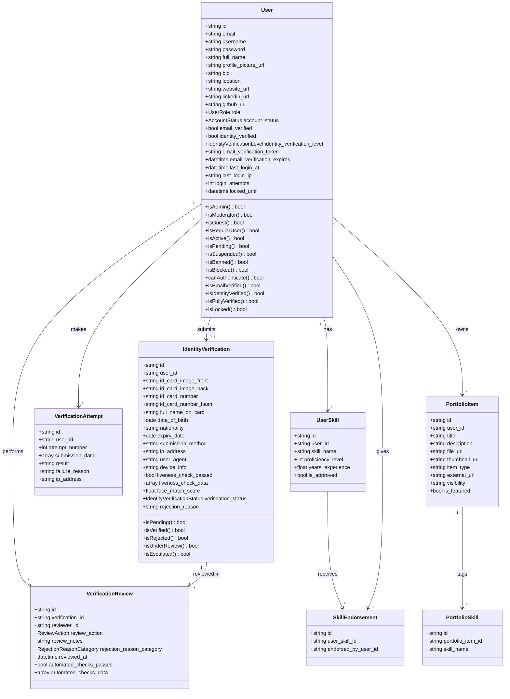

# Class Diagram: Authentication & Authorization (As-Built)

Attributes match the schema in [`erd/auth.md`](../erd/auth.md), minus
`created_at`/`updated_at`/`deleted_at` (present on every model, already
covered by the ERD). Enum-typed columns use the real PHP enum class from
`app/Enums/` where one exists (`UserRole`, `AccountStatus`, etc.), plain
`string` otherwise. Methods are the actual non-relationship public
methods on each model, taken from `app/Models/*.php`.

