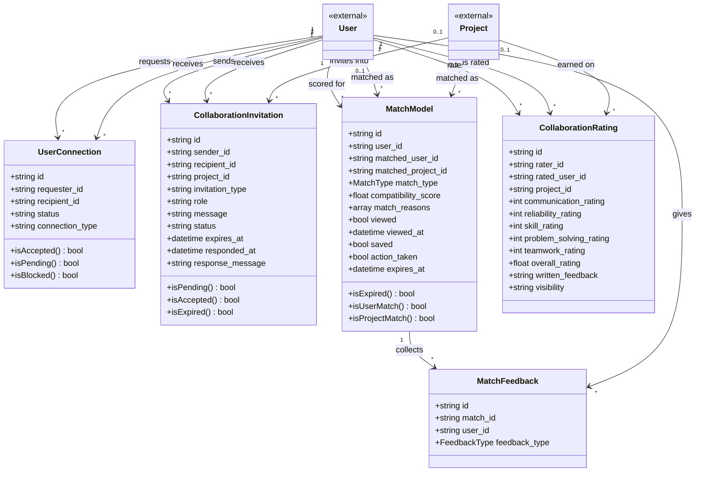

# Class Diagram: Collaboration (As-Built)

`User` and `Project` appear as external stubs. The real model class for
`MATCHES` is `MatchModel`, not `Match`; PHP's `Match` is a reserved word.

```mermaid
classDiagram
    class UserConnection {
        +string id
        +string requester_id
        +string recipient_id
        +string status
        +string connection_type
        +isAccepted() bool
        +isPending() bool
        +isBlocked() bool
    }
    class CollaborationInvitation {
        +string id
        +string sender_id
        +string recipient_id
        +string project_id
        +string invitation_type
        +string role
        +string message
        +string status
        +datetime expires_at
        +datetime responded_at
        +string response_message
        +isPending() bool
        +isAccepted() bool
        +isExpired() bool
    }
    class MatchModel {
        +string id
        +string user_id
        +string matched_user_id
        +string matched_project_id
        +MatchType match_type
        +float compatibility_score
        +array match_reasons
        +bool viewed
        +datetime viewed_at
        +bool saved
        +bool action_taken
        +datetime expires_at
        +isExpired() bool
        +isUserMatch() bool
        +isProjectMatch() bool
    }
    class MatchFeedback {
        +string id
        +string match_id
        +string user_id
        +FeedbackType feedback_type
    }
    class CollaborationRating {
        +string id
        +string rater_id
        +string rated_user_id
        +string project_id
        +int communication_rating
        +int reliability_rating
        +int skill_rating
        +int problem_solving_rating
        +int teamwork_rating
        +float overall_rating
        +string written_feedback
        +string visibility
    }
    class User {
        <<external>>
    }
    class Project {
        <<external>>
    }

    User "1" --> "*" UserConnection : requests
    User "1" --> "*" UserConnection : receives
    User "1" --> "*" CollaborationInvitation : sends
    User "1" --> "*" CollaborationInvitation : receives
    Project "0..1" --> "*" CollaborationInvitation : invites into
    User "1" --> "*" MatchModel : scored for
    User "0..1" --> "*" MatchModel : matched as
    Project "0..1" --> "*" MatchModel : matched as
    MatchModel "1" --> "*" MatchFeedback : collects
    User "1" --> "*" MatchFeedback : gives
    User "1" --> "*" CollaborationRating : rates
    User "1" --> "*" CollaborationRating : is rated
    Project "0..1" --> "*" CollaborationRating : earned on
```
