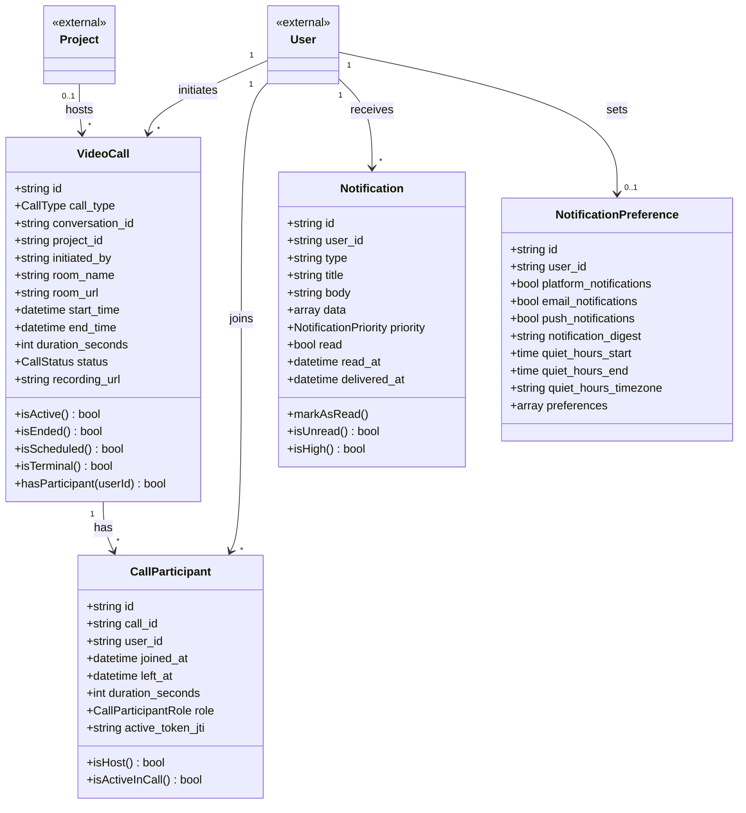

# Class Diagram: Communication (As-Built)

`User` and `Project` appear as external stubs. There are no
`Conversation` / `Message` classes; that data lives in Firebase, not
in an Eloquent model.

```mermaid
classDiagram
    class VideoCall {
        +string id
        +CallType call_type
        +string conversation_id
        +string project_id
        +string initiated_by
        +string room_name
        +string room_url
        +datetime start_time
        +datetime end_time
        +int duration_seconds
        +CallStatus status
        +string recording_url
        +isActive() bool
        +isEnded() bool
        +isScheduled() bool
        +isTerminal() bool
        +hasParticipant(userId) bool
    }
    class CallParticipant {
        +string id
        +string call_id
        +string user_id
        +datetime joined_at
        +datetime left_at
        +int duration_seconds
        +CallParticipantRole role
        +string active_token_jti
        +isHost() bool
        +isActiveInCall() bool
    }
    class Notification {
        +string id
        +string user_id
        +string type
        +string title
        +string body
        +array data
        +NotificationPriority priority
        +bool read
        +datetime read_at
        +datetime delivered_at
        +markAsRead()
        +isUnread() bool
        +isHigh() bool
    }
    class NotificationPreference {
        +string id
        +string user_id
        +bool platform_notifications
        +bool email_notifications
        +bool push_notifications
        +string notification_digest
        +time quiet_hours_start
        +time quiet_hours_end
        +string quiet_hours_timezone
        +array preferences
    }
    class User {
        <<external>>
    }
    class Project {
        <<external>>
    }

    User "1" --> "*" VideoCall : initiates
    Project "0..1" --> "*" VideoCall : hosts
    VideoCall "1" --> "*" CallParticipant : has
    User "1" --> "*" CallParticipant : joins
    User "1" --> "*" Notification : receives
    User "1" --> "0..1" NotificationPreference : sets
```
