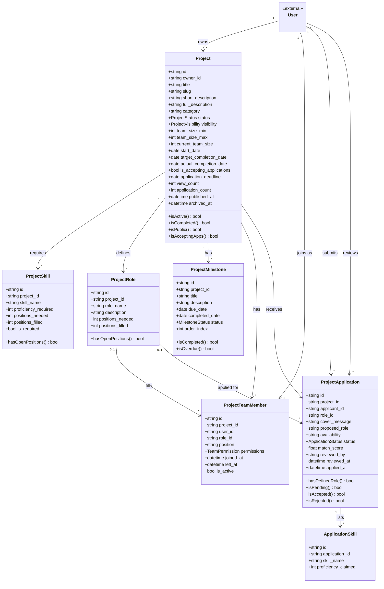

# Class Diagram: Project Management (As-Built)

`User` appears as an external stub. Same rules as the Auth class
diagram: real fields minus timestamps, real enums, real methods.

```mermaid
classDiagram
    class Project {
        +string id
        +string owner_id
        +string title
        +string slug
        +string short_description
        +string full_description
        +string category
        +ProjectStatus status
        +ProjectVisibility visibility
        +int team_size_min
        +int team_size_max
        +int current_team_size
        +date start_date
        +date target_completion_date
        +date actual_completion_date
        +bool is_accepting_applications
        +date application_deadline
        +int view_count
        +int application_count
        +datetime published_at
        +datetime archived_at
        +isActive() bool
        +isCompleted() bool
        +isPublic() bool
        +isAcceptingApps() bool
    }
    class ProjectSkill {
        +string id
        +string project_id
        +string skill_name
        +int proficiency_required
        +int positions_needed
        +int positions_filled
        +bool is_required
        +hasOpenPositions() bool
    }
    class ProjectRole {
        +string id
        +string project_id
        +string role_name
        +string description
        +int positions_needed
        +int positions_filled
        +hasOpenPositions() bool
    }
    class ProjectMilestone {
        +string id
        +string project_id
        +string title
        +string description
        +date due_date
        +date completed_date
        +MilestoneStatus status
        +int order_index
        +isCompleted() bool
        +isOverdue() bool
    }
    class ProjectTeamMember {
        +string id
        +string project_id
        +string user_id
        +string role_id
        +string position
        +TeamPermission permissions
        +datetime joined_at
        +datetime left_at
        +bool is_active
    }
    class ProjectApplication {
        +string id
        +string project_id
        +string applicant_id
        +string role_id
        +string cover_message
        +string proposed_role
        +string availability
        +ApplicationStatus status
        +float match_score
        +string reviewed_by
        +datetime reviewed_at
        +datetime applied_at
        +hasDefinedRole() bool
        +isPending() bool
        +isAccepted() bool
        +isRejected() bool
    }
    class ApplicationSkill {
        +string id
        +string application_id
        +string skill_name
        +int proficiency_claimed
    }
    class User {
        <<external>>
    }

    User "1" --> "*" Project : owns
    Project "1" --> "*" ProjectSkill : requires
    Project "1" --> "*" ProjectRole : defines
    Project "1" --> "*" ProjectMilestone : has
    Project "1" --> "*" ProjectTeamMember : has
    User "1" --> "*" ProjectTeamMember : joins as
    ProjectRole "0..1" --> "*" ProjectTeamMember : fills
    Project "1" --> "*" ProjectApplication : receives
    User "1" --> "*" ProjectApplication : submits
    ProjectRole "0..1" --> "*" ProjectApplication : applied for
    User "0..1" --> "*" ProjectApplication : reviews
    ProjectApplication "1" --> "*" ApplicationSkill : lists
```
