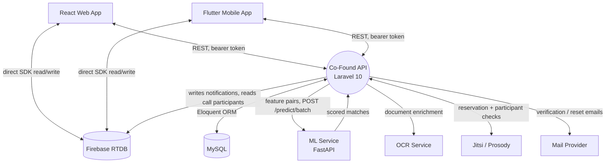

# Context Diagram (As-Built)

```mermaid
flowchart TB
    WebClient[React Web App]
    MobileClient[Flutter Mobile App]
    API((Co-Found API<br/>Laravel 10))
    MySQL[(MySQL)]
    Firebase[(Firebase RTDB)]
    ML[ML Service<br/>FastAPI]
    OCR[OCR Service]
    Jitsi[Jitsi / Prosody]
    Mail[Mail Provider]

    WebClient <-->|REST, bearer token| API
    MobileClient <-->|REST, bearer token| API
    WebClient <-->|direct SDK read/write| Firebase
    MobileClient <-->|direct SDK read/write| Firebase
    API -->|writes notifications, reads call participants| Firebase
    API <-->|Eloquent ORM| MySQL
    API -->|feature pairs, POST /predict/batch| ML
    ML -->|scored matches| API
    API -->|document enrichment| OCR
    API <-->|reservation + participant checks| Jitsi
    API -->|verification / reset emails| Mail
```

No payment system, no Redis cache, no internal "Matching Engine", those
were in the original proposal but never built.
