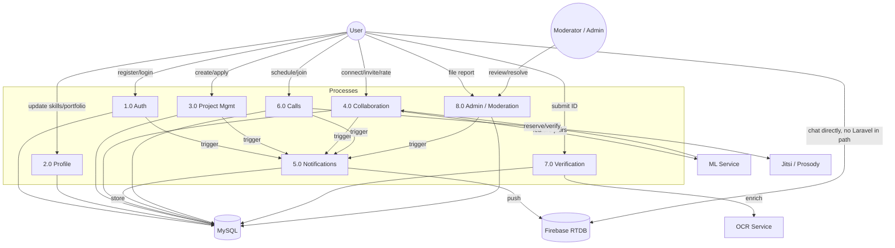

# Data Flow Diagram, Level 1 (As-Built)

```mermaid
flowchart TB
    User((User))
    ModAdmin((Moderator / Admin))
    MLsvc[ML Service]
    OCRsvc[OCR Service]
    JitsiSvc[Jitsi / Prosody]

    subgraph Processes
        P1[1.0 Auth]
        P2[2.0 Profile]
        P3[3.0 Project Mgmt]
        P4[4.0 Collaboration]
        P5[5.0 Notifications]
        P6[6.0 Calls]
        P7[7.0 Verification]
        P8[8.0 Admin / Moderation]
    end

    D1[(MySQL)]
    D2[(Firebase RTDB)]

    User -->|register/login| P1 --> D1
    User -->|update skills/portfolio| P2 --> D1
    User -->|create/apply| P3 --> D1
    User -->|connect/invite/rate| P4 --> D1
    P4 -->|feature pairs| MLsvc
    MLsvc -->|scores| P4
    P1 & P3 & P4 & P6 & P8 -->|trigger| P5
    P5 -->|store| D1
    P5 -->|push| D2
    User -->|chat directly, no Laravel in path| D2
    User -->|schedule/join| P6 --> D1
    P6 -->|reserve/verify| JitsiSvc
    User -->|submit ID| P7 --> D1
    P7 -->|enrich| OCRsvc
    User -->|file report| P8
    ModAdmin -->|review/resolve| P8 --> D1
```
