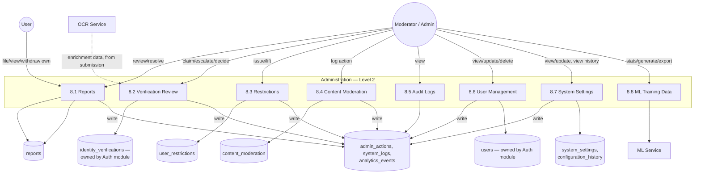

# DFD Level 2: Administration (As-Built)

Drills into process 8.0 from the
[system-wide Level 1 DFD](../data-flow-diagram-level1.md). The
`identity_verifications` and `users` data stores are dashed, they're
owned by the Authentication & Authorization module, this process only
reads and updates them.

