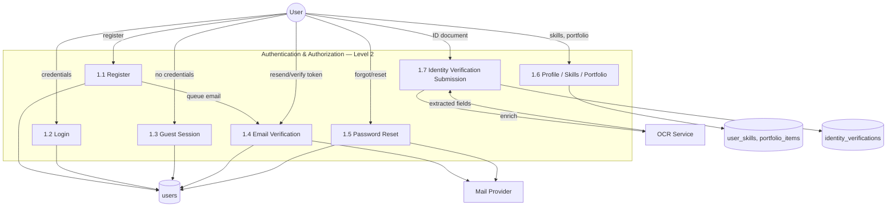

# DFD Level 2: Authentication & Authorization (As-Built)

Drills into process 1.0 from the
[system-wide Level 1 DFD](../data-flow-diagram-level1.md).

```mermaid
flowchart TB
    User((User))
    Mail[Mail Provider]
    OCR[OCR Service]

    subgraph Auth["Authentication & Authorization — Level 2"]
        P1[1.1 Register]
        P2[1.2 Login]
        P3[1.3 Guest Session]
        P4[1.4 Email Verification]
        P5[1.5 Password Reset]
        P6[1.6 Profile / Skills / Portfolio]
        P7[1.7 Identity Verification Submission]
    end

    D1[(users)]
    D2[(user_skills, portfolio_items)]
    D3[(identity_verifications)]

    User -->|register| P1 --> D1
    P1 -->|queue email| P4 --> Mail
    User -->|credentials| P2 --> D1
    User -->|no credentials| P3 --> D1
    User -->|resend/verify token| P4 --> D1
    User -->|forgot/reset| P5 --> D1
    P5 --> Mail
    User -->|skills, portfolio| P6 --> D2
    User -->|ID document| P7 --> D3
    P7 -->|enrich| OCR
    OCR -->|extracted fields| P7
```
