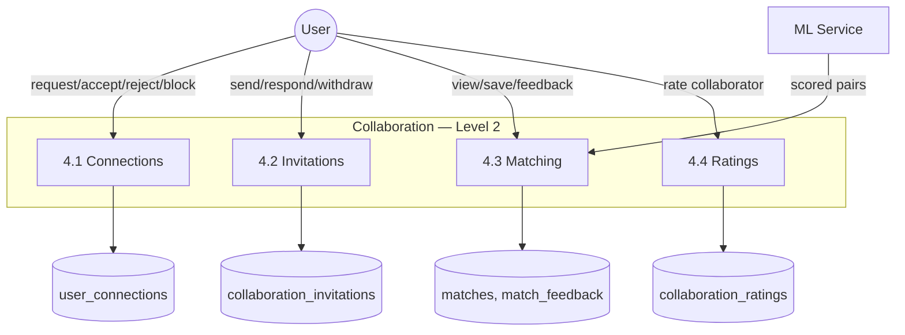

# DFD Level 2: Collaboration (As-Built)

Drills into process 4.0 from the
[system-wide Level 1 DFD](../data-flow-diagram-level1.md).
Accepting a **collaboration invitation** only updates its status and
notifies the sender, it does not touch `project_team_members`. Compare
with the Project Management DFD, where accepting an application does.

