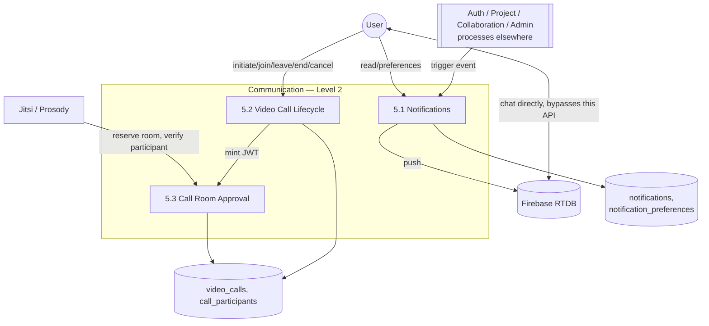

# DFD Level 2: Communication (As-Built)

Drills into process 5.0 from the
[system-wide Level 1 DFD](../data-flow-diagram-level1.md). The dashed
line is deliberate, direct chat between users bypasses this API
entirely and goes straight to Firebase.

