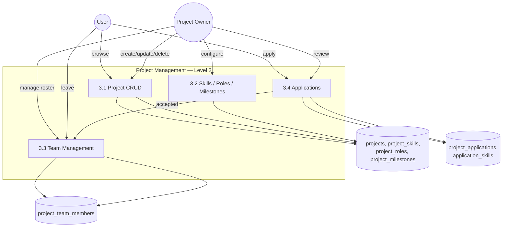

# DFD Level 2: Project Management (As-Built)

Drills into process 3.0 from the
[system-wide Level 1 DFD](../data-flow-diagram-level1.md).
Worth noting: accepting a **project application** (3.4) does
automatically create a team membership, a DB transaction in
`ProjectApplicationService::review()` does both in one step. That's the
opposite of what happens when accepting a **collaboration invitation**
(see the Collaboration DFD), which doesn't.

