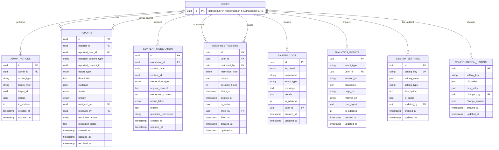

# ERD: Administration (As-Built)

`USERS` appears as a stub. `identity_verifications` lives in the Auth
module's ERD; this module only reviews it.

```mermaid
erDiagram
    USERS ||--o{ ADMIN_ACTIONS : "performs"
    USERS ||--o{ REPORTS : "files"
    USERS |o--o{ REPORTS : "is filed against"
    USERS ||--o{ CONTENT_MODERATION : "performs"
    USERS ||--o{ USER_RESTRICTIONS : "is restricted"
    USERS ||--o{ USER_RESTRICTIONS : "issues"
    USERS |o--o{ SYSTEM_LOGS : "triggers"
    USERS |o--o{ ANALYTICS_EVENTS : "triggers"
    USERS |o--o{ SYSTEM_SETTINGS : "last updated"
    USERS ||--o{ CONFIGURATION_HISTORY : "changes"

    ADMIN_ACTIONS {
        uuid id PK
        uuid admin_id FK
        string action_type
        string target_type
        uuid target_id
        json details
        ip ip_address
        timestamp created_at
        timestamp updated_at
    }
    REPORTS {
        uuid id PK
        uuid reporter_id FK
        uuid reported_user_id FK
        string reported_content_type
        uuid reported_content_id
        enum report_type
        text description
        json evidence
        enum status
        enum priority
        uuid assigned_to FK
        uuid resolved_by FK
        string resolution_action
        text resolution_notes
        timestamp created_at
        timestamp updated_at
        timestamp resolved_at
    }
    CONTENT_MODERATION {
        uuid id PK
        uuid moderator_id FK
        string content_type
        uuid content_id
        enum moderation_type
        text original_content
        text moderated_content
        enum action_taken
        text reason
        string guideline_referenced
        timestamp created_at
        timestamp updated_at
    }
    USER_RESTRICTIONS {
        uuid id PK
        uuid user_id FK
        uuid restricted_by FK
        enum restriction_type
        text reason
        int duration_hours
        timestamp starts_at
        timestamp expires_at
        bool is_active
        uuid lifted_by FK
        timestamp lifted_at
        timestamp created_at
        timestamp updated_at
    }
    SYSTEM_LOGS {
        uuid id PK
        enum log_level
        string component
        string event_type
        text message
        json details
        ip ip_address
        uuid user_id FK
        timestamp created_at
        timestamp updated_at
    }
    ANALYTICS_EVENTS {
        uuid id PK
        string event_type
        uuid user_id FK
        string session_id
        json properties
        string page_url
        string referrer_url
        text user_agent
        ip ip_address
        timestamp created_at
        timestamp updated_at
    }
    SYSTEM_SETTINGS {
        uuid id PK
        string setting_key UK
        json setting_value
        string setting_type
        text description
        bool is_public
        uuid updated_by FK
        timestamp created_at
        timestamp updated_at
    }
    CONFIGURATION_HISTORY {
        uuid id PK
        string setting_key
        json old_value
        json new_value
        uuid changed_by FK
        text change_reason
        timestamp created_at
        timestamp updated_at
    }
    USERS {
        uuid id PK "defined fully in Authentication & Authorization ERD"
    }
```
