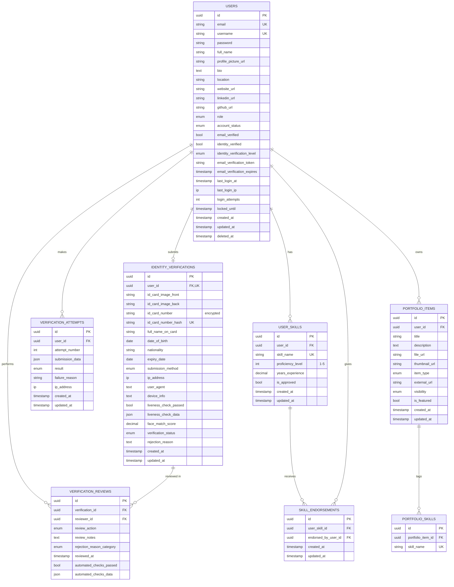

# ERD: Authentication & Authorization (As-Built)

All 8 tables owned by this module, every column, matching
`database/migrations/` including later alter migrations (e.g.
`id_card_number_hash` was added after the original create, and
`date_of_birth` was made nullable later; both reflected here).

