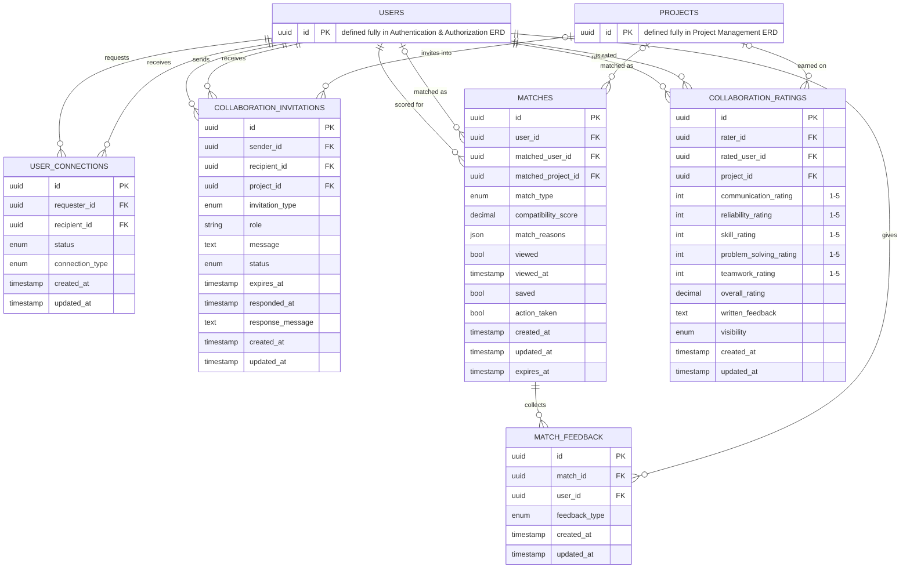

# ERD: Collaboration (As-Built)

`USERS` and `PROJECTS` appear as stubs, owned by the Authentication &
Authorization and Project Management modules respectively.

```mermaid
erDiagram
    USERS ||--o{ USER_CONNECTIONS : "requests"
    USERS ||--o{ USER_CONNECTIONS : "receives"
    USERS ||--o{ COLLABORATION_INVITATIONS : "sends"
    USERS ||--o{ COLLABORATION_INVITATIONS : "receives"
    PROJECTS |o--o{ COLLABORATION_INVITATIONS : "invites into"
    USERS ||--o{ MATCHES : "scored for"
    USERS |o--o{ MATCHES : "matched as"
    PROJECTS |o--o{ MATCHES : "matched as"
    MATCHES ||--o{ MATCH_FEEDBACK : "collects"
    USERS ||--o{ MATCH_FEEDBACK : "gives"
    USERS ||--o{ COLLABORATION_RATINGS : "rates"
    USERS ||--o{ COLLABORATION_RATINGS : "is rated"
    PROJECTS |o--o{ COLLABORATION_RATINGS : "earned on"

    USER_CONNECTIONS {
        uuid id PK
        uuid requester_id FK
        uuid recipient_id FK
        enum status
        enum connection_type
        timestamp created_at
        timestamp updated_at
    }
    COLLABORATION_INVITATIONS {
        uuid id PK
        uuid sender_id FK
        uuid recipient_id FK
        uuid project_id FK
        enum invitation_type
        string role
        text message
        enum status
        timestamp expires_at
        timestamp responded_at
        text response_message
        timestamp created_at
        timestamp updated_at
    }
    MATCHES {
        uuid id PK
        uuid user_id FK
        uuid matched_user_id FK
        uuid matched_project_id FK
        enum match_type
        decimal compatibility_score
        json match_reasons
        bool viewed
        timestamp viewed_at
        bool saved
        bool action_taken
        timestamp created_at
        timestamp updated_at
        timestamp expires_at
    }
    MATCH_FEEDBACK {
        uuid id PK
        uuid match_id FK
        uuid user_id FK
        enum feedback_type
        timestamp created_at
        timestamp updated_at
    }
    COLLABORATION_RATINGS {
        uuid id PK
        uuid rater_id FK
        uuid rated_user_id FK
        uuid project_id FK
        int communication_rating "1-5"
        int reliability_rating "1-5"
        int skill_rating "1-5"
        int problem_solving_rating "1-5"
        int teamwork_rating "1-5"
        decimal overall_rating
        text written_feedback
        enum visibility
        timestamp created_at
        timestamp updated_at
    }
    USERS {
        uuid id PK "defined fully in Authentication & Authorization ERD"
    }
    PROJECTS {
        uuid id PK "defined fully in Project Management ERD"
    }
```
