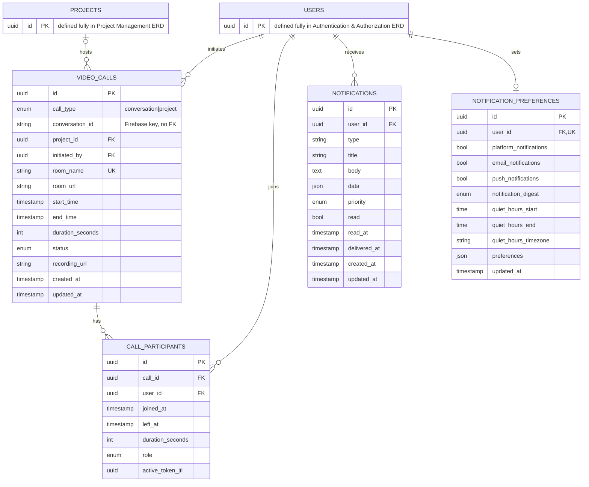

# ERD: Communication (As-Built)

Chat itself has no tables here; conversations and messages moved to
Firebase Realtime Database (see the `drop_mysql_chat_tables` migration).
`video_calls.conversation_id` is a plain string column, not a foreign
key; it holds a Firebase key, not a row in this database. `call_type`
is constrained at the database level (a CHECK constraint) so that
exactly one of `conversation_id` / `project_id` is set, never both.

