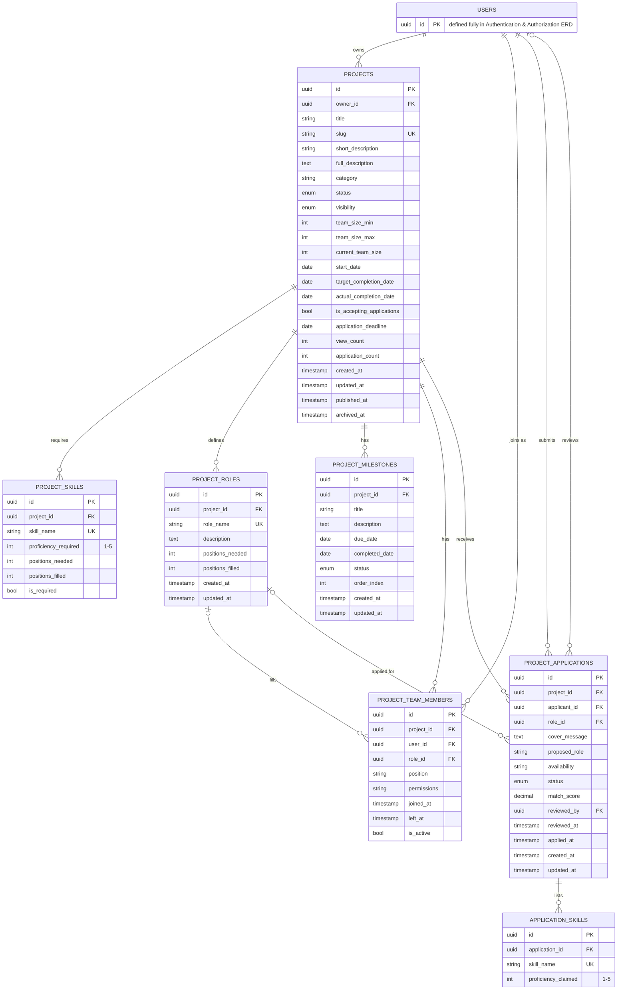

# ERD: Project Management (As-Built)

`USERS` appears as a stub; it's owned by the Authentication &
Authorization module. See [`erd/auth.md`](auth.md) for its full definition.

```mermaid
erDiagram
    USERS ||--o{ PROJECTS : "owns"
    PROJECTS ||--o{ PROJECT_SKILLS : "requires"
    PROJECTS ||--o{ PROJECT_ROLES : "defines"
    PROJECTS ||--o{ PROJECT_MILESTONES : "has"
    PROJECTS ||--o{ PROJECT_TEAM_MEMBERS : "has"
    USERS ||--o{ PROJECT_TEAM_MEMBERS : "joins as"
    PROJECT_ROLES |o--o{ PROJECT_TEAM_MEMBERS : "fills"
    PROJECTS ||--o{ PROJECT_APPLICATIONS : "receives"
    USERS ||--o{ PROJECT_APPLICATIONS : "submits"
    PROJECT_ROLES |o--o{ PROJECT_APPLICATIONS : "applied for"
    USERS |o--o{ PROJECT_APPLICATIONS : "reviews"
    PROJECT_APPLICATIONS ||--o{ APPLICATION_SKILLS : "lists"

    PROJECTS {
        uuid id PK
        uuid owner_id FK
        string title
        string slug UK
        string short_description
        text full_description
        string category
        enum status
        enum visibility
        int team_size_min
        int team_size_max
        int current_team_size
        date start_date
        date target_completion_date
        date actual_completion_date
        bool is_accepting_applications
        date application_deadline
        int view_count
        int application_count
        timestamp created_at
        timestamp updated_at
        timestamp published_at
        timestamp archived_at
    }
    PROJECT_SKILLS {
        uuid id PK
        uuid project_id FK
        string skill_name UK
        int proficiency_required "1-5"
        int positions_needed
        int positions_filled
        bool is_required
    }
    PROJECT_ROLES {
        uuid id PK
        uuid project_id FK
        string role_name UK
        text description
        int positions_needed
        int positions_filled
        timestamp created_at
        timestamp updated_at
    }
    PROJECT_MILESTONES {
        uuid id PK
        uuid project_id FK
        string title
        text description
        date due_date
        date completed_date
        enum status
        int order_index
        timestamp created_at
        timestamp updated_at
    }
    PROJECT_TEAM_MEMBERS {
        uuid id PK
        uuid project_id FK
        uuid user_id FK
        uuid role_id FK
        string position
        string permissions
        timestamp joined_at
        timestamp left_at
        bool is_active
    }
    PROJECT_APPLICATIONS {
        uuid id PK
        uuid project_id FK
        uuid applicant_id FK
        uuid role_id FK
        text cover_message
        string proposed_role
        string availability
        enum status
        decimal match_score
        uuid reviewed_by FK
        timestamp reviewed_at
        timestamp applied_at
        timestamp created_at
        timestamp updated_at
    }
    APPLICATION_SKILLS {
        uuid id PK
        uuid application_id FK
        string skill_name UK
        int proficiency_claimed "1-5"
    }
    USERS {
        uuid id PK "defined fully in Authentication & Authorization ERD"
    }
```
