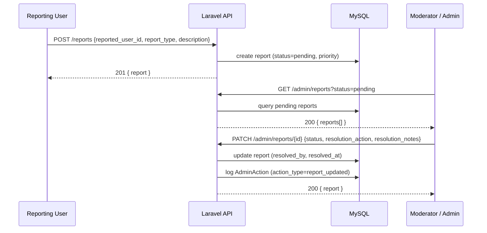

# Sequence: Admin Moderation (As-Built)

```mermaid
sequenceDiagram
    participant U as Reporting User
    participant API as Laravel API
    participant DB as MySQL
    participant Mod as Moderator / Admin

    U->>API: POST /reports {reported_user_id, report_type, description}
    API->>DB: create report (status=pending, priority)
    API-->>U: 201 { report }

    Mod->>API: GET /admin/reports?status=pending
    API->>DB: query pending reports
    API-->>Mod: 200 { reports[] }

    Mod->>API: PATCH /admin/reports/{id} {status, resolution_action, resolution_notes}
    API->>DB: update report (resolved_by, resolved_at)
    API->>DB: log AdminAction (action_type=report_updated)
    API-->>Mod: 200 { report }
```
