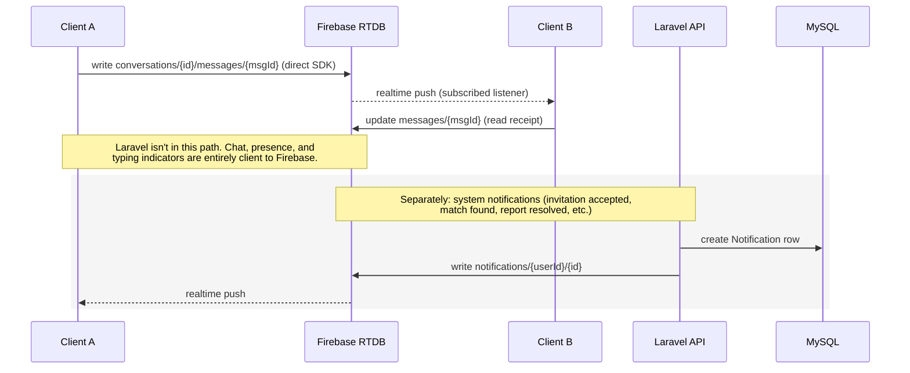

# Sequence: Chat (As-Built)

```mermaid
sequenceDiagram
    participant A as Client A
    participant FB as Firebase RTDB
    participant B as Client B
    participant API as Laravel API
    participant DB as MySQL

    A->>FB: write conversations/{id}/messages/{msgId} (direct SDK)
    FB-->>B: realtime push (subscribed listener)
    B->>FB: update messages/{msgId} (read receipt)
    Note over A,FB: Laravel isn't in this path. Chat, presence, and<br/>typing indicators are entirely client to Firebase.

    rect rgb(245,245,245)
    Note over API,FB: Separately: system notifications (invitation accepted,<br/>match found, report resolved, etc.)
    API->>DB: create Notification row
    API->>FB: write notifications/{userId}/{id}
    FB-->>A: realtime push
    end
```
