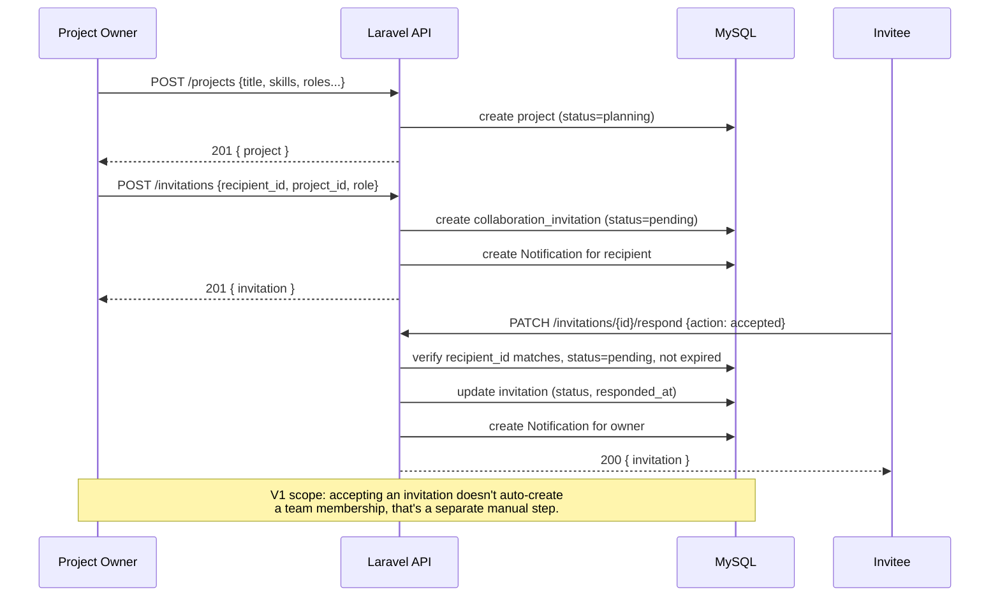

# Sequence: Project Creation & Invitation (As-Built)

```mermaid
sequenceDiagram
    participant Owner as Project Owner
    participant API as Laravel API
    participant DB as MySQL
    participant Rec as Invitee

    Owner->>API: POST /projects {title, skills, roles...}
    API->>DB: create project (status=planning)
    API-->>Owner: 201 { project }

    Owner->>API: POST /invitations {recipient_id, project_id, role}
    API->>DB: create collaboration_invitation (status=pending)
    API->>DB: create Notification for recipient
    API-->>Owner: 201 { invitation }

    Rec->>API: PATCH /invitations/{id}/respond {action: accepted}
    API->>DB: verify recipient_id matches, status=pending, not expired
    API->>DB: update invitation (status, responded_at)
    API->>DB: create Notification for owner
    API-->>Rec: 200 { invitation }

    Note over Owner,DB: V1 scope: accepting an invitation doesn't auto-create<br/>a team membership, that's a separate manual step.
```
