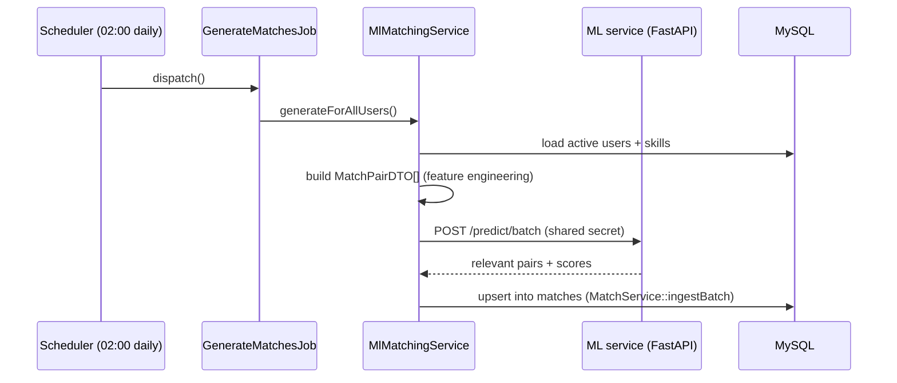

# Sequence: Smart Matching (As-Built)

The backend never scores matches itself, it just builds features and hands
them to the ML service.

The same `generateForUser()` path also runs synchronously, outside the
nightly batch, right after `AdminVerificationService` approves a user's
identity verification.
