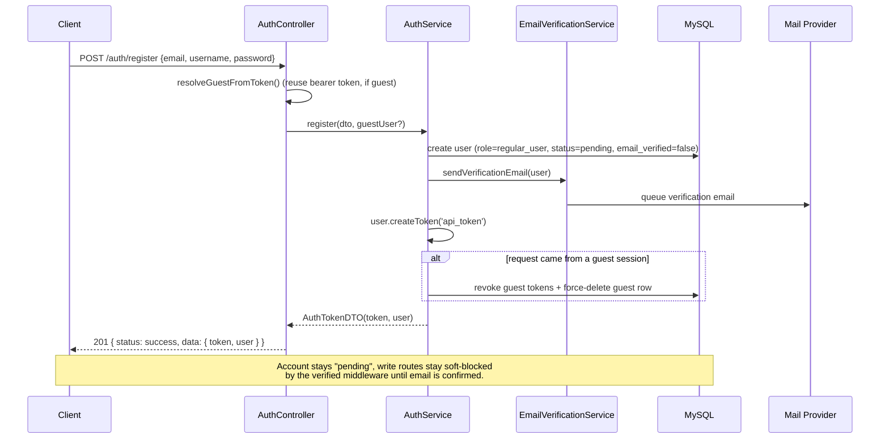

# Sequence: User Registration (As-Built)

```mermaid
sequenceDiagram
    participant C as Client
    participant AC as AuthController
    participant AS as AuthService
    participant EV as EmailVerificationService
    participant DB as MySQL
    participant Mail as Mail Provider

    C->>AC: POST /auth/register {email, username, password}
    AC->>AC: resolveGuestFromToken() (reuse bearer token, if guest)
    AC->>AS: register(dto, guestUser?)
    AS->>DB: create user (role=regular_user, status=pending, email_verified=false)
    AS->>EV: sendVerificationEmail(user)
    EV->>Mail: queue verification email
    AS->>AS: user.createToken('api_token')
    alt request came from a guest session
        AS->>DB: revoke guest tokens + force-delete guest row
    end
    AS-->>AC: AuthTokenDTO(token, user)
    AC-->>C: 201 { status: success, data: { token, user } }
    Note over C,DB: Account stays "pending", write routes stay soft-blocked<br/>by the verified middleware until email is confirmed.
```
