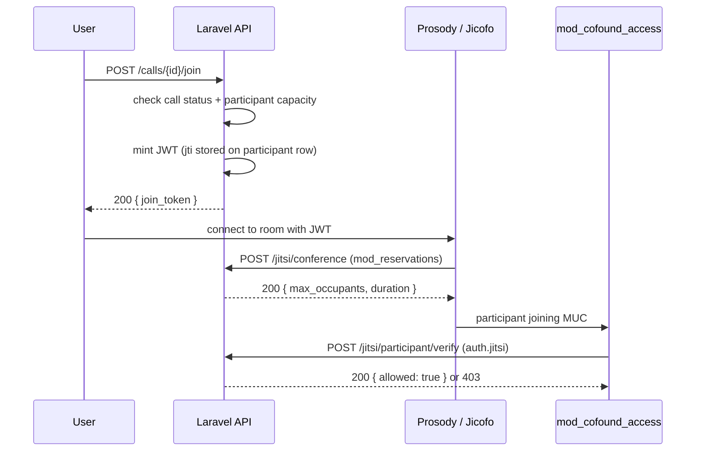

# Sequence: Video Call Room Approval (As-Built)

Not in the original 10 diagrams, video calls are a real V1 feature so it's
included here. Laravel doesn't host the call, it just decides whether Jicofo
(Jitsi's conference focus) is allowed to create the room, by implementing the
[Jicofo reservation API](https://github.com/jitsi/jicofo/blob/master/doc/reservation.md).
On join, it mints a short-lived JWT tied to a `jti` stored on the participant
row, so rotating the `jti` (on reconnect) silently invalidates any still-open
token from a previous session.

