# Use Case Diagram: Administration (As-Built)

Filing/viewing/withdrawing a report is a Regular User action, the
`reports` table lives in this module because reviewing and resolving it
does, but the initial filing isn't a moderation action. `UserRole::isModerator()`
returns true for both moderators and administrators, so their use cases
overlap almost entirely, administrators additionally get settings,
user management, and audit logs.

```mermaid
flowchart LR
    User([Regular User])
    Mod([Moderator])
    Admin([Administrator])

    subgraph Rep["Reports"]
        UC1((File Report))
        UC2((View / Withdraw Own Report))
        UC3((Update / Delete Own Report))
        UC4((Review Report Queue))
        UC5((Resolve / Dismiss Report))
    end

    subgraph Ver2["Verification Review"]
        UC6((Claim Verification))
        UC7((Escalate Verification))
        UC8((Approve / Reject Verification))
    end

    subgraph Restrict["Restrictions"]
        UC9((Issue Restriction))
        UC10((View Restrictions))
        UC11((Lift Restriction))
    end

    subgraph Mod2["Content Moderation"]
        UC12((Log Moderation Action))
    end

    subgraph Logs["Audit"]
        UC13((View Action Logs))
        UC14((View System Logs))
    end

    subgraph Users2["User Management"]
        UC15((View / Update / Delete User))
        UC16((View User's Verification))
        UC17((View User's Reports))
    end

    subgraph Settings["System Settings"]
        UC18((View / Update Setting))
        UC19((View Setting History))
    end

    subgraph MLops["ML Training Data"]
        UC20((View Dataset Stats))
        UC21((Generate / Export Training Data))
    end

    User --> UC1
    User --> UC2
    User --> UC3
    Mod --> UC4
    Mod --> UC5
    Mod --> UC6
    Mod --> UC7
    Mod --> UC8
    Mod --> UC9
    Mod --> UC10
    Mod --> UC11
    Mod --> UC12
    Admin --> UC4
    Admin --> UC5
    Admin --> UC6
    Admin --> UC7
    Admin --> UC8
    Admin --> UC9
    Admin --> UC10
    Admin --> UC11
    Admin --> UC12
    Admin --> UC13
    Admin --> UC14
    Admin --> UC15
    Admin --> UC16
    Admin --> UC17
    Admin --> UC18
    Admin --> UC19
    Admin --> UC20
    Admin --> UC21
```

