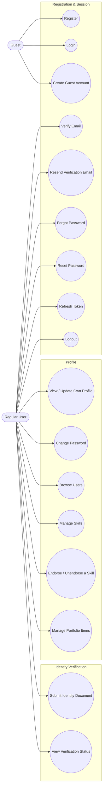

# Use Case Diagram: Authentication & Authorization (As-Built)

Every use case here maps to a real endpoint in `routes/v1/auth.php`,
`routes/v1/profile.php`, or `routes/v1/verification.php`.

```mermaid
flowchart LR
    Guest([Guest])
    User([Regular User])

    subgraph Reg["Registration & Session"]
        UC1((Register))
        UC2((Login))
        UC3((Create Guest Account))
        UC4((Verify Email))
        UC5((Resend Verification Email))
        UC6((Forgot Password))
        UC7((Reset Password))
        UC8((Refresh Token))
        UC9((Logout))
    end

    subgraph Prof["Profile"]
        UC10((View / Update Own Profile))
        UC11((Change Password))
        UC12((Browse Users))
        UC13((Manage Skills))
        UC14((Endorse / Unendorse a Skill))
        UC15((Manage Portfolio Items))
    end

    subgraph Ver["Identity Verification"]
        UC16((Submit Identity Document))
        UC17((View Verification Status))
    end

    Guest --> UC1
    Guest --> UC2
    Guest --> UC3
    User --> UC4
    User --> UC5
    User --> UC6
    User --> UC7
    User --> UC8
    User --> UC9
    User --> UC10
    User --> UC11
    User --> UC12
    User --> UC13
    User --> UC14
    User --> UC15
    User --> UC16
    User --> UC17
```
