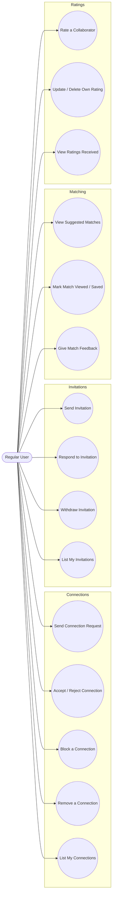

# Use Case Diagram: Collaboration (As-Built)

```mermaid
flowchart LR
    User([Regular User])

    subgraph Conn["Connections"]
        UC1((Send Connection Request))
        UC2((Accept / Reject Connection))
        UC3((Block a Connection))
        UC4((Remove a Connection))
        UC5((List My Connections))
    end

    subgraph Inv["Invitations"]
        UC6((Send Invitation))
        UC7((Respond to Invitation))
        UC8((Withdraw Invitation))
        UC9((List My Invitations))
    end

    subgraph Match["Matching"]
        UC10((View Suggested Matches))
        UC11((Mark Match Viewed / Saved))
        UC12((Give Match Feedback))
    end

    subgraph Rate["Ratings"]
        UC13((Rate a Collaborator))
        UC14((Update / Delete Own Rating))
        UC15((View Ratings Received))
    end

    User --> UC1
    User --> UC2
    User --> UC3
    User --> UC4
    User --> UC5
    User --> UC6
    User --> UC7
    User --> UC8
    User --> UC9
    User --> UC10
    User --> UC11
    User --> UC12
    User --> UC13
    User --> UC14
    User --> UC15
```
