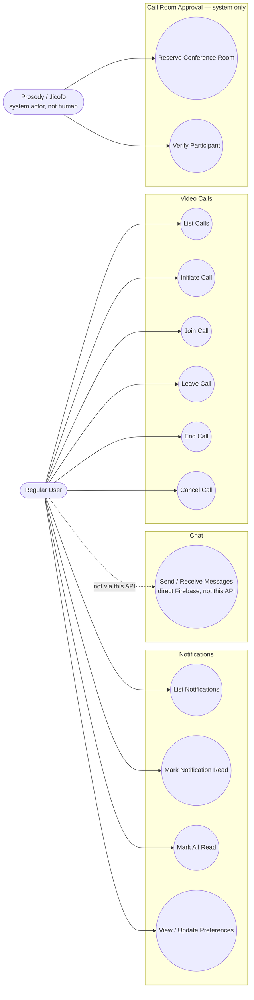

# Use Case Diagram: Communication (As-Built)

"Send / Receive Messages" is shown dashed on purpose, it's a real thing
users do, but it doesn't go through this API at all, the client talks to
Firebase directly. "Reserve Conference Room" and "Verify Participant"
are actual endpoints (`/jitsi/conference`, `/jitsi/participant/verify`),
but the caller is Prosody, not a person, hence the separate system actor.

