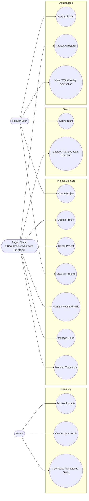

# Use Case Diagram: Project Management (As-Built)

"Project Owner" isn't a real role, it's shorthand here for "the Regular
User who owns this particular project," enforced by policy checks
(`project.owner_id === user.id`), not by `UserRole`.

